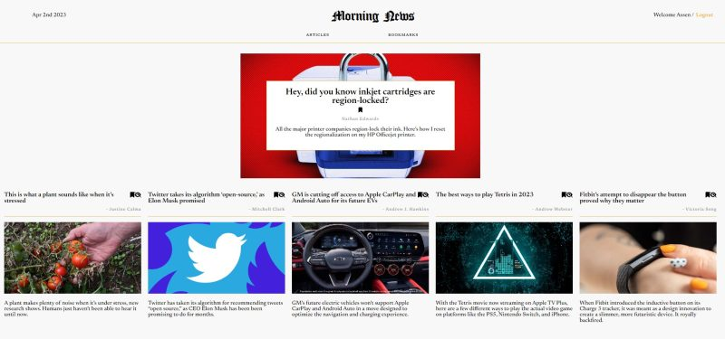

# MorningNews-frontend

Morning News is a React application developped in duration of 5 days as part of the fullstack web development bootcamp in La Capsule (Lyon, 2023). 
It displays a top article and 5 other articls fetched from a public api. User can login and then bookmark articles.

This repository is the frontend of the application.  
[Link to the backend github repository](https://github.com/asseniliev/MorningNews-backend)

Functionality available:
1. User signup and user login
2. Welcome message at top right corner; user logout
3. Fetch articles from newsapi.org, visualize top article and 5 other articles
4. Mark articles in bookbacks, only when user logged
5. Hide an article from the list (using the eye icon)
6. Switch between 'Articles' and 'Bookmarks' pages

Skills trained and exercised:
1. Fetch data from an external API and get json result
2. Using bcrypt methods to work with encrypted passwords
3. Use uid2 library to generate security token used as supplenetary authentication
4. Work with Redux to store data for users, articles and bookmarks
5. Store data in persistance store
6. Work with UseState and UseEffect hooks
7. Work with props to cascade info from parent to child component